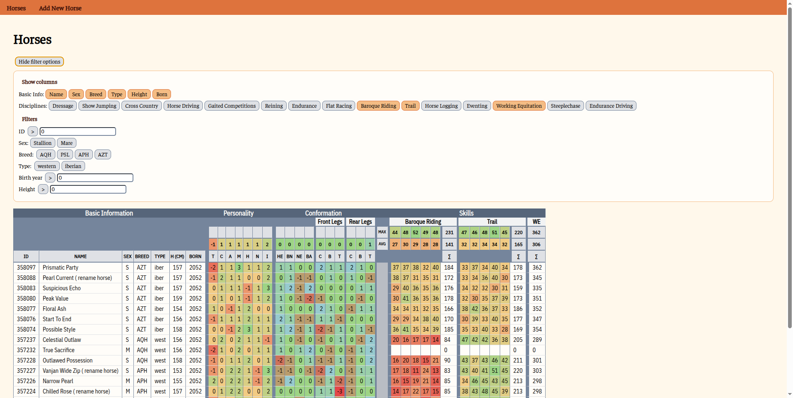

# EP Horse Manager

Work-in-progress.

A personal project to develop a standalone app to track horses and breeding in the EquinePassion browser game https://www.equinepassion-browsergame.com

## Core features

### Add horses easily

Just copy-paste the whole horse page, no need to manually input all the information.

### View and compare

- See all the horses in one table with the relevant information visible, including maximum and average values for (sub) skills. 
- Filter the view by breed, type, sex, etc. to see horses relevant for a specific project.
- Select which information to include.
- Personality and conformation are translated from text descriptors to corresponding number scale [-3, 3].
- Order the table by any column.

